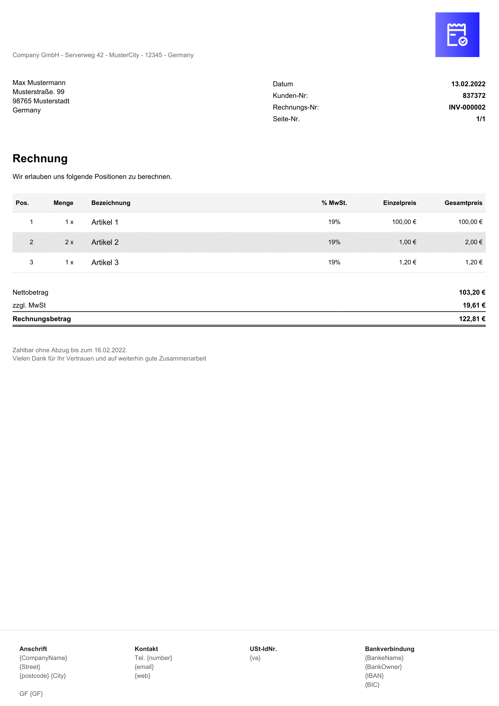

# InvoiceShelf – Custom Invoice Template

This is a custom invoice template for [InvoiceShelf](https://github.com/InvoiceShelf/InvoiceShelf), an open-source invoicing system.

## Preview



## ⚠️ Important Notes

To ensure this template works correctly, **please follow the instructions below before using it in production**:

1. **Manually add the customer number to the notes field**  
   InvoiceShelf **does not automatically provide the customer number** to the PDF template.  
   To make it appear in the invoice, you **must manually enter it in the notes field**, for example:


2. **Manually fill in the footer section**  
   The lower section of the invoice (footer), such as:
- Bank account information
- Managing director(s)
- Tax number, VAT ID

...is **not automatically pulled from the InvoiceShelf configuration**.  
These fields must be filled manually inside the Blade template.

## Installation

Make sure to replace `<Docker-Name>` with the name of your running InvoiceShelf container.

```
docker cp invoice4.blade.php <Docker-Name>:/var/www/html/InvoiceShelf/resources/views/app/pdf/invoice
```

if you rename the template please note that you have to rename the PNG as well
```
docker cp invoice4.png <Docker-Name>:/var/www/html/InvoiceShelf/resources/static/img/PDF
```

